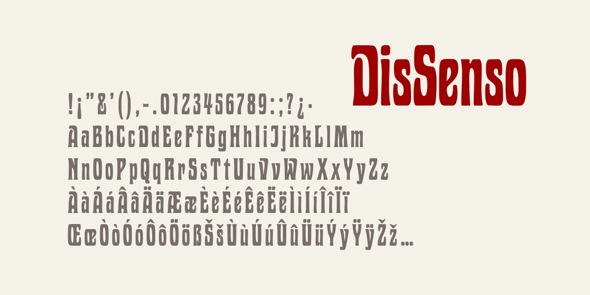

# DisSenso
Aggiornamento alla versione 1.1.

## Descrizione

Il carattere **DisSenso** è basato su un font diffuso agli inizi del Novecento [soprattutto in ambito tedesco](https://www.typeoff.de/2022/08/how-old-is-the-specimen-and-the-typeface/) e
distribuito con vari nomi, come [*Medea*, *Viktoria* o *Phönix*](https://fontsinuse.com/typefaces/77099/viktoria).
Anche in Italia aveva nomi diversi, come *Urania* di [Nebiolo](https://books.google.it/books?id=QBDdVK3ifTMC&pg=RA2-PA97) o come *Serie Milano* di [Pierallini](https://issuu.com/archiviotipografico/docs/pierallini___turchi/160).

**DisSenso** è stato realizzato in ricordo di [Giacomo Matteotti](https://it.wikipedia.org/wiki/Giacomo_Matteotti), deputato socialista ucciso da fascisti nel 1924.
Come previsto dalla [legge 10 luglio 2023, n. 92](https://www.gazzettaufficiale.it/eli/id/2023/07/21/23G00101/sg), «la Repubblica, nell'ambito delle finalita' di salvaguardia e promozione del proprio patrimonio culturale, storico e letterario, celebra la figura di Giacomo Matteotti nella ricorrenza dei cento anni dalla sua morte, promuovendo e valorizzando la conoscenza e lo studio della sua opera e del suo pensiero in ambito nazionale e internazionale.»

Il font originario era utilizzato per titoli in varie pubblicazioni socialiste di quel periodo, come l'*[Almanacco Socialista Italiano](https://books.google.it/books?id=tMSXj9P78NEC&pg=PA1)* (1918)
o il quotidiano *Avanti!*; si hanno titoli con questo carattere anche nel mese del rapimento e omicidio di Matteotti
(ad esempio il [13 giugno](https://avanti.senato.it/js/pdfjs-dist/web/viewer.html?file=/files/reader.php?f%3DAvanti%201896-1993%20PDF/10.%20Avanti%20Ed.%20Nazionale%20%28Milano%29%201922-1924%20OCR%2FRAV0037037_1924_0140.PDF), pagina 2 e
il [17 giugno](https://avanti.senato.it/js/pdfjs-dist/web/viewer.html?file=/files/reader.php?f%3DAvanti%201896-1993%20PDF/10.%20Avanti%20Ed.%20Nazionale%20(Milano)%201922-1924%20OCR/19240617_143_1_Edizione+milanese.pdf), pagina 2). 
